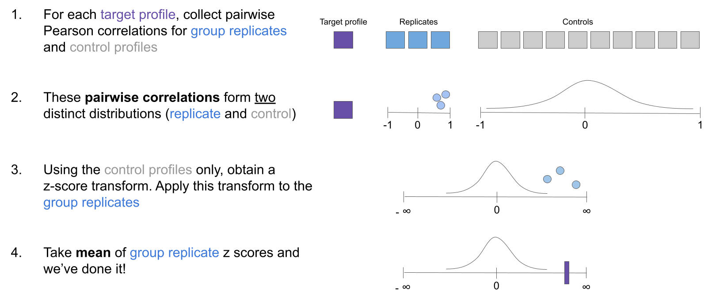
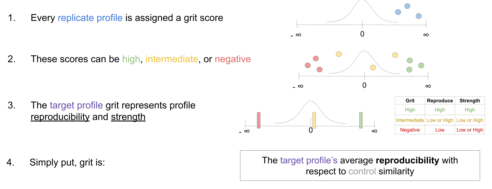

# Benchmarking Grit

Grit is defined by [Merrian Webster](https://www.merriam-webster.com/dictionary/grit) as "firmness of mind or spirit; unyielding courage in the face of hardship or danger".
We borrow this concept to define a metric by the same name.
Grit represents the **phenotypic strength of a perturbation in a profiling experiment**.

Whether an image-based profiling experiment (e.g. Measuring cell morphology via Cell painting) or a gene expression profiling experiment (e.g. perturb-Seq), grit can be calculated **for each perturbation**.

Grit is data-driven and requires minimal user intervention.
The user just needs to define (1) replicate and (2) control profiles.
The user does not need to determine an empirical null distribution, nor set any thresholds.

Grit combines two concepts:

1. How reproducible are perturbations of the same group (e.g. replicates)
2. How different are perturbations from a control group (e.g. DMSO treatment)

Additionally, since grit is based on z-scores, the magnitude can be easily compared between perturbations _and is a directly interpretable value_.
E.g. A grit score of 5 for `compound X` compared to a DMSO control means that "on average, compound X is 5 standard deviations more similar to replicates than to DMSO controls".


## Grit implementation

We use the grit implementation in the [cytominer-eval](https://github.com/cytomining/cytominer-eval) python package.

The cytominer-eval package is still under active development, but can still be installed:

```bash
# Install via pip
pip install git+git://github.com/cytomining/cytominer-eval@@56bd9e545d4ce5dea8c2d3897024a4eb241d06db
```

Also see [`environment.yml`](environment.yml) for a full package listing required to reproduce the analyses presented in this repository.

## Grit calculation

Calculating grit is a simple multi-step procedure:



## Grit interpretation

Grit is directly interpretable:


